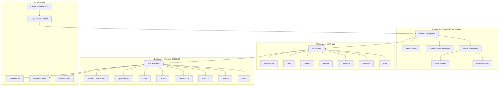

# Toolboxx (Toolbay) — Deep Analysis & Startup Revenue Report

> **Domain:** [toolbay.net](https://toolbay.net) | **Stack:** Next.js 15 + Payload CMS 3.54 + MongoDB + tRPC 
> **Target Market:** East African Construction Supply Chain (Rwanda-first, expanding to Uganda & Tanzania) 
> **Date:** June 29, 2026

---

## Table of Contents

1. [Executive Summary](#1-executive-summary)
2. [Current State — Deep Technical Analysis](#2-current-state--deep-technical-analysis)
3. [Business Model & Revenue Streams](#3-business-model--revenue-streams)
4. [Technical Requirements for Production Startup](#4-technical-requirements-for-production-startup)
5. [Resource Requirements](#5-resource-requirements)
6. [Go-to-Market Roadmap](#6-go-to-market-roadmap)
7. [Risk Analysis](#7-risk-analysis)
8. [Financial Projections](#8-financial-projections)

---

## 1. Executive Summary

Toolboxx (branded **Toolbay**) is a **multi-tenant B2B/B2C e-commerce marketplace** targeting the construction materials industry in East Africa. The MVP is surprisingly mature — **~66,000 lines of code across 408 source files** with 17 database collections, 18 tRPC API routers, 18 construction calculators, a tender/bidding system, in-app chat, push notifications, and a sponsorship/advertising engine.

### What Already Works (MVP Strengths)
-  Full multi-tenant architecture with store verification workflow
-  Product catalog with location-based filtering (Rwanda/Uganda/Tanzania)
-  Mobile Money (MTN MoMo) + Bank Transfer payment flows
-  Manual payment verification by tenant owners
-  Tender/RFQ system with bidding
-  Product sponsorship/advertising system
-  18 construction-specific calculators (concrete, brick, roofing, etc.)
-  In-app messaging (buyer ↔ seller)
-  Push notifications (Web Push via VAPID)
-  Zero-downtime Docker deployment to DigitalOcean
-  CI/CD via GitHub Actions → GHCR → DigitalOcean Droplet
-  Cloudflare R2 media storage with image optimization
-  Email delivery via Resend

### Critical Gaps for Market Fit & Revenue Generation
- **No Android/iOS Native Applications** (Crucial for the Rwandan market where mobile app adoption exceeds web browsing).
- **Strict e-commerce payment walls** — Rwandan buyers and sellers need a "freemium" period to build trust before being forced into direct online payments.
- **Platform fee is hardcoded to 0** — no revenue from transactions once payments are enabled.
- **No automated payment processing** (Mobile Money API not integrated).
- **Multi-tenant plugin is disabled** (commented out in payload.config.ts).
- **No subscription/SaaS tier system** for tenants.
- **No analytics dashboard** for business intelligence.

---

## 2. Current State — Deep Technical Analysis

### 2.1 Architecture Overview

### 2.2 Data Model Analysis
*(Detailed in MVP review. Collections are mature but hooks for monetization are currently disabled).*

### 2.3 Tenant Verification System (Unique Differentiator)
The platform has a **3-tier verification system**: Unverified, Document Verified (RDB certificate), and Physically Verified (on-site visit). This builds **trust in a market where trust is the #1 barrier to online purchasing**.

### 2.4 Payment Flow & The "Trust Gap"
Currently, the flow forces buyers to use a USSD code and input a TX ID. 
**Market Reality in Rwanda:** Many buyers and sellers are hesitant to transact purely online without seeing the goods first. 
**Pivot Required:** You must introduce a **"Pay on Delivery"** or **"Connect with Seller"** flow. Let the platform act as a lead-generation tool (freemium) to build adoption, before introducing hard payment gates and transaction fees.

---

## 3. Business Model & Revenue Streams (Localized for Rwanda)

To match the Rwandan economy and typical salaries, pricing must be highly accessible. The strategy is **Land and Expand**: offer the core platform for free to build liquidity (buyers + sellers), then monetize premium features.

### 3.1 Primary Revenue Streams

#### Stream 1: Tenant Subscription Tiers (Freemium SaaS)
The primary driver for the first 12 months. Start sellers on a free tier to prove value.

| Tier | Price/Month | Features |
|---|---|---|
| **Free (Lead Gen)** | 0 RWF | 10 product listings, manual verification, "Contact Seller" button instead of direct checkout |
| **Starter** | 5,000 RWF | 50 listings, online checkout enabled, basic analytics, priority verification |
| **Professional** | 15,000 RWF | Unlimited listings, sponsored products (3 free/month), API access |
| **Enterprise** | 50,000 RWF | White-label store, bulk upload, dedicated support, unlimited tender creation |

#### Stream 2: Product Sponsorship/Advertising (Already Built)
Geo-targeted product promotion.
| Metric | Value |
|---|---|
| Suggested Rate | 500 - 1,000 RWF/day per product |
| Est. Revenue | 50 sponsors × 1,000 RWF/day = **50,000 RWF/day** |

#### Stream 3: Tender Listing Fees
| Metric | Value |
|---|---|
| Model | Free to post basic tenders; premium features for fee (featured, extended deadlines) |
| Suggested Rate | 2,000 - 5,000 RWF per premium tender |

#### Stream 4: Transaction Commission (Deferred until trust is established)
Once buyers are comfortable paying online, activate the `platformFee`.
| Metric | Value |
|---|---|
| Suggested Rate | 2-3% on verified transactions |

### 3.2 Secondary Revenue Streams
- **Logistics Commission:** 10% cut from connecting buyers with delivery partners.
- **Calculator Premium Features:** PDF exports or saved calculations (e.g., 1,000 RWF/month for contractors).
- **Physical Verification Fee:** Charge 10,000 RWF to physically verify a store and grant them the trusted badge.
- **Market Intelligence:** Sell regional material price trends to large construction firms.

---

## 4. Technical Requirements for Production Startup

### 4.1 Critical (Must Have Before Launch)

#### A. Mobile Applications (Android & iOS)
In Rwanda, internet penetration is overwhelmingly mobile-first. A responsive web app is not enough for retention.
- **Requirement:** Build a React Native (Expo) app leveraging the existing tRPC API.
- **Features:** Push notifications for orders/messages, camera integration for fast product uploads, offline caching.

#### B. Freemium & "Pay on Delivery" Workflows
- **Requirement:** Modify the checkout flow to allow "Pay on Delivery" or "Request Quote/Contact". Do not force MoMo payments for free-tier sellers.

#### C. Mobile Money API Integration
For paid-tier stores, replace manual USSD-based payment with automated payment via **MTN MoMo API** or an aggregator like **Flutterwave** (which supports MoMo, Airtel Money, and cards).

#### D. Re-enable Multi-Tenant Plugin & Fix Data Isolation
The `@payloadcms/plugin-multi-tenant` is currently commented out in `payload.config.ts`. It must be re-enabled to ensure secure data isolation.

#### E. Security Hardening
- Change admin seed password from "demo".
- Add API rate limiting.
- Implement proper input sanitization on all tRPC procedures.

### 4.2 High Priority (First 3 Months)
- **Analytics Dashboard:** For sellers to see profile views, product clicks, and lead generation stats.
- **Automated Subscription Billing:** Recurring billing via MoMo for Starter/Pro tiers.
- **Full-text Search:** Implement Meilisearch for fast Kinyarwanda/English/French product searches.

---

## 5. Resource Requirements (Localized for Rwanda)

### 5.1 Team Requirements (Monthly Salaries in RWF)
Salaries adjusted to match the local tech ecosystem in Kigali.

| Role | Count | Monthly Salary Range (RWF) | Priority |
|---|---|---|---|
| **Full-Stack Dev (React/Next/RN)** | 1 | 800,000 - 1,500,000 | 🔴 Critical |
| **Backend/DevOps Engineer** | 1 | 800,000 - 1,500,000 | 🔴 Critical |
| **Product & UI/UX Manager** | 1 | 500,000 - 1,000,000 | 🟡 High |
| **Sales/BD (On-ground Seller Acq.)**| 2 | 300,000 - 600,000 (Base + Com) | 🔴 Critical |
| **Customer Support** | 1 | 200,000 - 400,000 | 🟡 High |
| **Total Monthly Team Cost** | **6** | **2,900,000 - 5,600,000 RWF** | |

### 5.2 Infrastructure Costs
| Service | Details | Monthly Cost |
|---|---|---|
| DigitalOcean Droplet | 4GB-8GB RAM | 25,000 - 50,000 RWF |
| MongoDB Atlas | M10-M20 dedicated | 60,000 - 100,000 RWF |
| Cloudflare R2 + CDN | Media Storage | 5,000 - 15,000 RWF |
| **Total Monthly Infra** | | **90,000 - 165,000 RWF** |

### 5.3 Legal, Compliance & Marketing (Initial 6 Months)
- **Business Registration & RDB:** ~50,000 RWF
- **Data Protection Law Compliance:** ~200,000 RWF
- **Marketing (Hardware store visits, targeted Meta Ads):** ~500,000 RWF/month

---

## 6. Go-to-Market Roadmap

### Phase 1: Foundation & Lead Gen (Months 1-3)
- **Goal:** Build liquidity (supply side). Focus on onboarding hardware stores in Kigali (Gisozi, Nyabugogo).
- **Tech:** Develop React Native mobile app (Android MVP). Implement "Contact Seller" / "Pay on Delivery" flows. Fix security vulnerabilities.
- **Target:** 150 verified sellers on the Free tier.

### Phase 2: Trust & Monetization (Months 4-6)
- **Goal:** Introduce paid features to the most active users.
- **Tech:** Launch MTN MoMo API integration. Release Starter & Pro subscription tiers. Activate Product Sponsorship UI.
- **Target:** 500 total sellers, 50 paying subscribers, 20 active sponsorships daily.

### Phase 3: Scale & iOS App (Months 7-9)
- **Goal:** Expand to secondary cities (Musanze, Rubavu) and launch iOS app.
- **Tech:** Launch Tender premium features, analytics dashboards for sellers, and logistics provider marketplace.
- **Target:** 1,000 total sellers, 150 paying subscribers.

### Phase 4: Expansion & Transactions (Months 10-12)
- **Goal:** Enforce transaction commissions on high-trust buyers. Expand to Uganda/Tanzania.
- **Tech:** Launch escrow payment system. Cross-border multi-currency pricing support.
- **Target:** 2,000+ sellers, 300 paying subscribers, steady flow of transaction commissions.

---

## 7. Risk Analysis

| Risk | Probability | Impact | Mitigation |
|---|---|---|---|
| Low tech-literacy among sellers | 🔴 High | 🔴 High | Keep the mobile app extremely simple; use voice-notes in chat; provide heavy on-ground support. |
| Lack of trust in online payments | 🔴 High | 🔴 High | Use the Freemium model; rely on "Pay on Delivery" and physical verification badges initially. |
| Competition | 🟡 Medium | 🟡 Medium | Niche focus on construction; use the 18 free calculators as an organic traffic moat. |
| Burn rate vs Revenue | 🔴 High | 🔴 High | Keep the team lean; rely on early subscription and sponsorship revenue before transaction volume grows. |

---

## 8. Financial Projections (12-Month Conservative, RWF)

### Revenue Model
*Focusing purely on Subscriptions, Sponsorships, and Verification fees for the first 6 months, slowly introducing commissions later.*

| Month | Sellers | Paying Subs | Sub Revenue | Sponsorships | Verification/Tender | Total Monthly Revenue (RWF) |
|---|---|---|---|---|---|---|
| 1-2 | 100 | 0 | 0 | 0 | 50,000 | **50,000 RWF** |
| 3-4 | 300 | 20 | 150,000 | 100,000 | 100,000 | **350,000 RWF** |
| 5-6 | 600 | 50 | 400,000 | 300,000 | 200,000 | **900,000 RWF** |
| 7-8 | 1,000 | 100 | 900,000 | 600,000 | 350,000 | **1,850,000 RWF** |
| 9-10 | 1,500 | 200 | 1,800,000 | 1,200,000 | 500,000 | **3,500,000 RWF** |
| 11-12 | 2,000 | 350 | 3,200,000 | 2,000,000 | 800,000 | **6,000,000 RWF** |

### Break-Even Analysis
| Metric | Value |
|---|---|
| Monthly burn rate (lean team + infra + marketing) | ~3,500,000 - 5,000,000 RWF |
| **Expected break-even** | **Month 10 - 11** |
| 12-month cumulative revenue | ~25,000,000 RWF |
| 12-month cumulative costs | ~50,000,000 RWF |
| **Funding runway needed** | **~25,000,000 - 35,000,000 RWF** ($18k - $25k USD) |

---

## Summary of Immediate Action Items

> [!IMPORTANT]
> **Top 4 actions for the Rwandan Market:**

1. **Develop the Mobile App:** Start building a React Native / Expo application immediately. Web apps do not convert well for B2B/B2C construction in Rwanda.
2. **Implement "Contact Seller" / "Pay on Delivery":** Bypass the forced MoMo TX ID checkout for early users to build trust and increase lead generation.
3. **On-ground Acquisition:** Hire 1-2 junior BD reps to physically visit hardware stores in Gisozi and Nyabugogo to onboard them onto the Free tier.
4. **Localize Pricing & Monetize Later:** Turn off forced commissions. Focus first on getting 500 sellers on the platform for free, then introduce the 5,000 RWF/month Starter tier and Sponsored listings.
